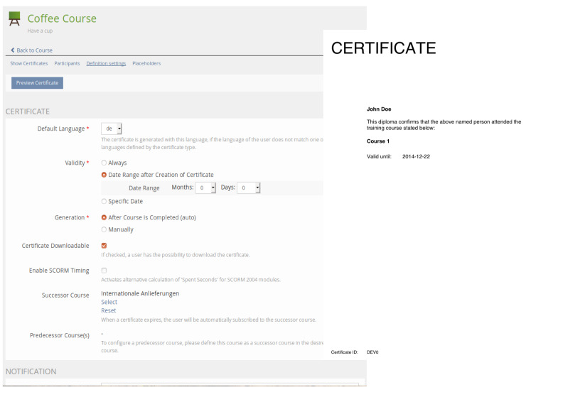

# Certificate

The certificate plugin offers an enhanced support for creating and administrating certificates inside ILIAS.



## Features

* Multiple certificate types with different layouts
* Generate pretty PDF layouts with JasperReports, the world’s most popular open source reporting engine
* Custom placeholders in certificates
* Multiple languages
* Certificates (pdf files) are stored in the ILIAS data directory instead of getting generated dynamically
* Revision of files
* Rendering PDF certificates with the integraded PDF Service in ILIAS (>= 4.4) or with JasperReports

## Installation
Start at your ILIAS root directory
```bash
mkdir -p Customizing/global/plugins/Services/UIComponent/UserInterfaceHook
cd Customizing/global/plugins/Services/UIComponent/UserInterfaceHook
git clone https://github.com/studer-raimann/Certificate.git Certificate
```
Update and activate the plugin in the ILIAS Plugin Administration

Please also install and enable [CertificateCron](https://github.com/studer-raimann/CertificateCron).

<del>
This plugin has some dependencies on other plugins and services. 
Please follow the installation guide of the [documentation](/doc/Documentation.pdf?raw=true).
</del>

## Documentation

An installation and user guide is available in [the doc/Documentation.pdf](/doc/Documentation.pdf?raw=true) file.

### Requirements
* ILIAS 5.4 or ILIAS 6
* PHP >=7.0

### Adjustment suggestions
* Adjustment suggestions by pull requests
* Adjustment suggestions which are not yet worked out in detail by Jira tasks under https://jira.studer-raimann.ch/projects/PLCERTIFICATE
* Bug reports under https://jira.studer-raimann.ch/projects/PLCERTIFICATE
* For external users you can report it at https://plugins.studer-raimann.ch/goto.php?target=uihk_srsu_PLCERTIFICATE

### ILIAS Plugin SLA
Wir lieben und leben die Philosophie von Open Source Software! Die meisten unserer Entwicklungen, welche wir im Kundenauftrag oder in Eigenleistung entwickeln, stellen wir öffentlich allen Interessierten kostenlos unter https://github.com/studer-raimann zur Verfügung.

Setzen Sie eines unserer Plugins professionell ein? Sichern Sie sich mittels SLA die termingerechte Verfügbarkeit dieses Plugins auch für die kommenden ILIAS Versionen. Informieren Sie sich hierzu unter https://studer-raimann.ch/produkte/ilias-plugins/plugin-sla.

Bitte beachten Sie, dass wir nur Institutionen, welche ein SLA abschliessen Unterstützung und Release-Pflege garantieren.

[overview]: /doc/Images/certificate_plugin_preview.jpg?raw=true "Preview of certificate plugin"
